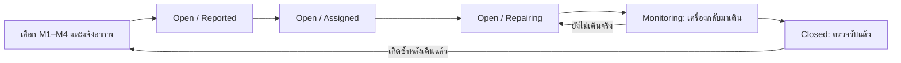
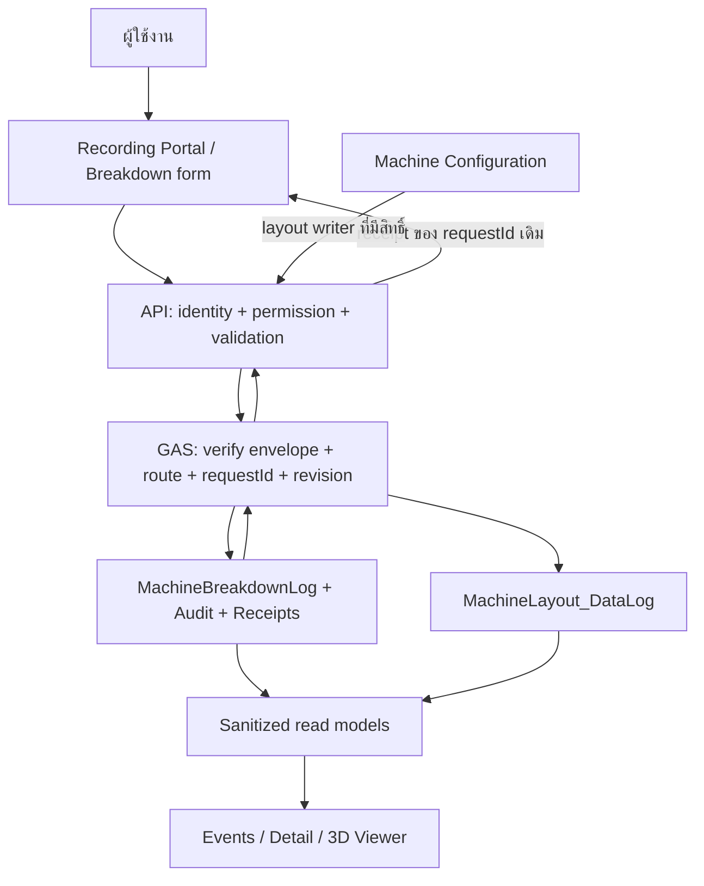

# แผนพัฒนา Machine Breakdown Records สำหรับใช้งานจริง

วันที่จัดทำ: 2026-10-02 · เขตเวลา Asia/Bangkok

เอกสารนี้เป็นแผนจากการตรวจโค้ดใน workspace ไม่ใช่ผลยืนยัน production end-to-end และยังไม่ได้ deploy GAS, แก้ production Sheet หรือ commit/push ในรอบจัดทำแผนนี้

## 1. เป้าหมายและขอบเขต

ให้ผู้ใช้งานแจ้งเหตุเครื่อง M1–M4 รับงานซ่อม บันทึกการแก้ไข ทดลองเดินเครื่อง และปิดงานบนเหตุการณ์เดิมได้ พร้อมยืนยันว่าข้อมูลบันทึกใน Google Sheet จริง และให้ Events, Detail และ 3D Viewer แสดงข้อมูลสอดคล้องกัน

แยกหน้าที่ดังนี้:

| ส่วน | หน้าที่ | แหล่งข้อมูลหลัก |
| --- | --- | --- |
| Machine Configuration | ตั้งสินค้าและสถานะประจำเครื่อง | `MachineLayout_DataLog` |
| Machine Breakdown Records | แจ้งเหตุ เลือกเครื่อง อ่านการตั้งค่าแบบล็อก | `MachineBreakdownLog` |
| Machine Breakdown Events | รายการเหตุ กรองเครื่อง/สินค้า/กะ/สถานะ | `MachineBreakdownLog` |
| Machine Breakdown Event Detail | รับงาน บันทึกซ่อม ทดลองเดินเครื่อง ปิดงาน ดูประวัติ | เหตุการณ์เดิม + ประวัติการเปลี่ยนแปลง |
| Yakitori Machine 3D Viewer | แสดงสินค้า สถานะตั้งค่า เหตุที่ยังไม่ปิดและข้อมูลล่าสุด | Layout + Breakdown read models |

ไม่ย้ายผลผลิตเดิม ไม่เปลี่ยน Target ของ Dashboard และไม่สร้างรายการซ่อมใหม่ทุกครั้งที่อัปเดตเหตุเดิม รูปประกอบ/อะไหล่/Alarm เป็นระยะถัดไปหลังแกนระบบผ่าน

## 2. ผลตรวจระบบปัจจุบันและช่องว่าง

หลักฐานจาก source ณ เวลาตรวจ; workspace มีงาน Machine Configuration ที่กำลังเปลี่ยนแปลง จึงต้องทำ baseline ใหม่เมื่อเริ่ม implementation

| ประเด็น | สิ่งที่พบจริง | งานที่ต้องทำ |
| --- | --- | --- |
| ผลบันทึก | `yakitori-runtime.js` POST แบบ `no-cors` แล้วคืน `queued: true` | แยกส่งแล้ว/ยืนยันแล้ว; ต้องมี receipt ของ operation นั้น |
| Event ID | browser สร้าง ID หลังส่ง; GAS สร้าง ID อีกแบบจากเวลาถึงระดับวินาที และไม่ได้คืน ID | ใช้ ID เดียวตลอดทุกหน้า พร้อม requestId ป้องกันบันทึกซ้ำ |
| Update | `saveBreakdownRecord_` เป็น append; ไม่พบ update/close action | เพิ่มการแก้ไขเหตุเดิมด้วย eventId และ revision |
| ข้อมูลเวลา | มีวันเริ่ม + เวลาเริ่ม/จบ; ไม่มีวันจบ | ใช้ startedAt/restoredAt เพื่อรองรับข้ามวัน/เกิน 24 ชั่วโมง |
| กะ | hidden field กำหนด `A` | ให้เลือกกะจริง; ไม่เดาจากเวลาจนได้ตารางกะที่ยืนยัน |
| ผู้รับงาน | Sheet มี `owner` แต่ฟอร์มยังไม่มี; ผู้บันทึกเป็นชื่อกรอกเอง | เพิ่มผู้รับผิดชอบและตัวตนที่ backend ตรวจได้ |
| อาการ/สาเหตุ | ใช้ `rootCause` สำหรับทั้งอาการและสาเหตุ | แยก symptom กับ confirmedRootCause |
| ตำแหน่งเสีย | machineArea ถูกใช้ระบุชื่อเครื่อง | เพิ่ม component แยกชุดอุปกรณ์ที่เสีย |
| การอ่านประวัติ | หน้า Log ใช้ localStorage; Events/Detail อ่าน GAS และ fallback local | cache ต้องเป็นข้อมูลยืนยันแล้ว; draft แยกจากประวัติจริง |
| Detail URL | ถ้า id ไม่พบ เปิดเหตุแรกแทน | แสดง “ไม่พบเหตุการณ์นี้” ไม่สลับไปเหตุอื่น |
| Filter เครื่อง | Events ใช้ machineVersion แทน station | กรองจาก M1–M4 / machineId |
| Feed error | บางหน้าไม่ตรวจ `payload.status`; `_records` ที่หายถูกแปลงเป็นว่าง | แยก success-empty, invalid response, read error และ stale |
| Viewer | เลือกเหตุล่าสุดตาม createdAt; เหตุ Closed ที่ใหม่กว่าอาจบดบัง Open เก่า | ให้เหตุ active มีความสำคัญเหนือประวัติ Closed |
| ความหมายสี | Layout `idle` กับ Breakdown `Open` ใช้สีต่างความหมาย | แยกจุดสีสถานะติดตั้งกับป้ายแจ้ง Breakdown |
| Safe rendering | user text ถูกใส่ใน template `innerHTML` ใน Log/Events/Detail/Viewer | ใช้ textContent / DOM builders สำหรับข้อความผู้ใช้ |
| สิทธิ์ | browser session/รหัสผ่านอยู่ใน JS; `doPost` ไม่มี server authorization ของ Breakdown | ใช้ระบบ auth/permission ของแผนกลาง; ทดสอบ direct API bypass |
| Sheet creation | เปิด Log แล้วเรียก `create_breakdown_sheet` | สร้าง/เพิ่ม schema ผ่าน admin migration เท่านั้น |
| Storage routing | Breakdown เขียน active spreadsheet; read รองรับ BL23G_M1/M2 storage routes; Layout ใช้ spreadsheet แยก | กำหนด Breakdown storage หลักแบบ explicit ให้ read/write ตรงกันทุกสินค้า |
| Schema migration | `ensureSheet_` เพิ่ม headers เฉพาะ Sheet ว่าง | ห้ามคิดว่าเพิ่ม array headers แล้ว Sheet เก่าจะเพิ่มคอลัมน์เอง |
| Loss Proxy | ใช้ target productivity × ชั่วโมงหยุด; target เป็น sticks/person/hour | ไม่เรียกว่า output lost โดยไม่มี manpower/line rate และหน่วยที่ตรวจแล้ว |
| Deployment | `main` trigger Pages workflow แต่ไม่ deploy GAS | มี checklist และ version map แยกสองระบบ |

ผล baseline ที่รันระหว่างจัดทำแผน (2026-10-02): ชุด CI ปัจจุบัน 42 tests ผ่าน 41, ไม่ผ่าน 1 เพราะ `MachineConfiguration.html` อยู่ใน Pages allowlist แต่ยัง untracked; `machine-configuration.css/js` ต้องรวมใน candidate release ด้วย ห้ามแก้ test ให้ละเว้นไฟล์เพื่อให้ผ่าน

baseline นี้เป็น local unit/artifact checks ใช้ Sheet จำลอง ไม่ใช่ live GAS test และไม่ใช่ browser verification ของ Breakdown workflow ใหม่

## 3. กระบวนการหน้างานที่เสนอ

คงค่าที่ระบบเดิมรู้จัก `Open`, `Monitoring`, `Closed` และเพิ่ม `repairStage` สำหรับ Open เพื่อไม่ทำให้ client เดิมอ่านสถานะใหม่ผิด



1. ผู้แจ้งเลือกเครื่อง ระบบอ่านสินค้าประจำเครื่องมาเป็นค่าเริ่มต้น กรอกวันเวลาเริ่มหยุด กะ อาการ ประเภทเหตุ และจุดอุปกรณ์
2. สร้างเหตุ `Open/Reported`; หลัง backend ยืนยันแล้วจึงแสดง Event ID และเปิด Detail ของ ID เดียวกัน
3. หัวหน้างานหรือช่างรับงาน ระบุ owner/เวลาเข้ารับงาน เปลี่ยน repairStage เป็น Assigned/Repairing โดย update เหตุเดิม
4. ระบุสาเหตุที่ตรวจพบ วิธีแก้ไข และเวลาที่เครื่องกลับมาเดินจริง; เปลี่ยนเป็น Monitoring และหยุดนับ downtime ที่ restoredAt
5. ผู้ตรวจรับบันทึกผลทดลองเดินและชื่อผู้ตรวจ/เวลา verifiedAt แล้วปิดเป็น Closed; เวลา closedAt แยกจาก restoredAt เพื่อไม่เอาช่วงเฝ้าดูไปรวม downtime
6. ถ้าอัปเดตผิด ใช้แก้ไขพร้อมเหตุผลและ audit; ถ้าเครื่องหยุดซ้ำหลังกลับมาเดินแล้ว ให้สร้างเหตุใหม่และเชื่อม relatedEventId ไม่ดัดแปลงช่วงหยุดเดิมให้รวมช่วงเดิน
7. การยกเลิกรายการผิดใช้ voidedAt/voidReason โดยผู้มีสิทธิ์ พร้อม audit; ไม่นับใน active state/สถิติ และไม่ลบแถวจริง

ข้อกำหนดป้องกันซ้ำ: เครื่องหนึ่งมีเหตุ machine-stop active ได้หนึ่งเหตุเป็นค่าเริ่มต้น เมื่อพบเหตุเปิดอยู่ให้เปิดเหตุเดิมหรือแนบข้อมูลใหม่ผ่าน update; duplicate request ใช้ requestId อีกชั้นหนึ่ง เหตุย้อนหลัง/เหตุที่ไม่หยุดเครื่องต้องมีกฎแยกและไม่เปลี่ยนสถานะเครื่องปัจจุบันโดยอัตโนมัติ

## 4. ฟอร์มและข้อมูลที่ต้องเพิ่ม

### 4.1 แจ้งเหตุเริ่มต้น — กรอกให้สั้น

| ข้อมูล | บังคับ | หลักการ |
| --- | --- | --- |
| station / machineId | ใช่ | เลือก M1–M4; backend ตรวจ mapping YK-101–YK-104 |
| productCode / productNameSnapshot | เมื่อเป็นเหตุระหว่างผลิต | ค่าเริ่มต้นจาก Configuration; เปลี่ยนสินค้าเฉพาะเหตุย้อนหลังได้พร้อมเหตุผล ไม่เขียนกลับ Layout |
| startedAt | ใช่ | วันเวลาเครื่องเริ่มหยุด ไม่ใช่เวลาส่งฟอร์ม |
| shift | ใช่ | ตัวเลือกกะที่โรงงานใช้งานจริง; เริ่มด้วย A/B ตามระบบเดิม |
| eventType / stopCategory | ใช่ | ขัดข้องเครื่อง / หยุดจากกระบวนการ / หยุดตามแผน |
| symptom | ใช่ | อาการที่พบ เช่น เซนเซอร์ไม่จับ/ไม้ค้าง |
| component | แนะนำ | Sensor / ชุดป้อน / ชุดเสียบไม้ / สายพาน / ระบบไฟฟ้า / อื่น ๆ |
| severity | ใช่ มีค่าเริ่มต้น | กำหนดความเร่งด่วนตามเกณฑ์โรงงาน; ชื่อ/ตัวเลือกไม่ใช่การอนุญาตให้เดินเครื่อง |
| submitter | อัตโนมัติ | actor ที่ backend ยืนยัน; ชื่อหน้างานเก็บเป็น display field แยก |
| affectedTrial / batchRef / note | ไม่บังคับ | เชื่อมรอบผลิต/ล็อตถ้ามี |

กรณี Configuration อ่านไม่สำเร็จ: ไม่แสดงค่าเริ่มต้นเป็นสถานะจริง แสดงเวลาข้อมูลเก่า/ปุ่มลองใหม่; ยังแจ้งเหตุได้เมื่อผู้มีสิทธิ์ยืนยันเครื่องและสินค้าที่กรอกเอง พร้อม `layoutSnapshotSource=manual` และเหตุผล

### 4.2 รับงาน–ซ่อม–ปิดงานใน Detail

| ขั้นตอน | ข้อมูลขั้นต่ำ |
| --- | --- |
| รับงาน | owner, assignedAt, expectedRevision |
| ซ่อม | repairStage, repairStartedAt, confirmedRootCause, actionTaken |
| กลับมาเดิน/Monitoring | restoredAt, actionTaken, บันทึกผลเดินเบื้องต้น |
| ปิดงาน | restoredAt, owner, actionTaken, verifiedBy, verifiedAt, verificationResult, สาเหตุหรือ `causePending` + เหตุผล |
| แก้หลังปิด | correctionReason, permission, expectedRevision; เก็บค่าก่อน/หลัง |
| ยกเลิก | voidReason, permission, audit |

ไม่บังคับให้เดาสาเหตุเพื่อปิดงาน ถ้าตรวจไม่พบให้เลือก “ยังยืนยันสาเหตุไม่ได้” และระบุเหตุผล การปิดงานต้องมีผลตรวจรับและเวลาคืนเครื่องจริง

### 4.3 ข้อมูลเวลาและผลกระทบ

- รับ timestamp แบบ ISO 8601 พร้อม offset เช่น `2026-10-02T23:50:00+07:00`; normalize เป็น UTC ฝั่ง server และแสดงด้วย Asia/Bangkok ทุกหน้า
- `durationMin = (restoredAt - startedAt)/60000` เมื่อคืนเครื่องแล้ว; ก่อนคืนเครื่องให้ durationMin เป็น null และแสดง elapsedDowntimeMin แยก ไม่บันทึกค่าที่เดินทุกวินาทีลง Sheet
- ตรวจเวลาจริง: startedAt <= restoredAt <= verifiedAt <= closedAt ตามขั้นตอน; reject วันผิด/เวลาอนาคตที่ไม่สมเหตุสมผล ห้ามเดาวันจบอัตโนมัติจาก endTime ที่น้อยกว่า startTime
- ตัวอย่าง 23:50 ถึงวันถัดไป 00:20 = 30 นาที; ถ้าหยุดข้าม 2 วันต้องคำนวณจากวันที่จริง
- Current Status ของเหตุและ Machine status ของ Configuration เป็นคนละข้อมูล และไม่เปลี่ยนกันด้วยการรีเซ็ตฟอร์ม
- เหตุ Waiting Material/QC Hold/Changeover ไม่นับเป็น mechanical failure ใน MTTR; ใช้ stopCategory + isMachineFailure ที่ server validate
- เก็บ Loss Proxy เดิมไว้เพื่ออ่านประวัติ แต่หน้าใหม่ไม่รวมกับ measured output loss; หากไม่มี rate/manpower ที่ยืนยัน แสดง “ยังไม่ประเมิน”
- ถ้าจะคำนวณ estimatedOutputLoss: ใช้ lineRateSticksPerHourSnapshot × downtime hours หรือ productivity × manpowerSnapshot × downtime hours และระบุชัดว่าเป็นประมาณการ หน่วยเป็น sticks
- รอบแรกแสดงจำนวนเหตุ, จำนวนเปิด, downtime ที่จบแล้ว, elapsed ของเหตุเปิด, MTTR เฉพาะ machine-failure ที่เวลาครบ; ยังไม่แสดง MTBF/OEE จนมีข้อมูล operating time/planned production time ครบ

## 5. Data model และแผนคอลัมน์ Google Sheet

### 5.1 Storage contract

- ใช้ `MachineBreakdownLog` กลางหนึ่ง storage สำหรับ M1–M4 และทุก productCode; ไม่เลือก spreadsheet ตามสินค้าใน dropdown
- กำหนด `BREAKDOWN_SPREADSHEET_ID` เป็น config ฝั่ง server และให้ write/read/update ใช้ resolver เดียวกัน ตรวจ actual deployment ว่าชี้ Sheet เดิมก่อนเปลี่ยนจาก getActiveSpreadsheet
- Layout ยังคง `MachineLayout_DataLog` และ mapping M1→YK-101, M2→YK-102, M3→YK-103, M4→YK-104
- อ่าน ID การจัดเก็บและ secrets จาก config ที่เหมาะสม; browser ส่งได้แค่ logical entity/eventId ไม่ส่ง arbitrary spreadsheetId/ชื่อ Sheet เพื่อเลือกที่เขียน

### 5.2 คอลัมน์เดิมที่ต้องคงไว้

`eventId, createdAt, breakdownDate, line, shift, machineVersion, conveyorPosition, machineArea, station, eventType, severity, breakdownStatus, startTime, endTime, durationMin, lossProxy, impactOutput, affectedTrial, rootCause, actionTaken, owner, submitter, note, recordType`

ห้ามสลับตำแหน่ง/เปลี่ยนชื่อคอลัมน์เดิมในการ release นี้ writer ใหม่ต้อง map ผ่าน header ไม่ใช้ positional array ที่คิดว่าคอลัมน์ครบเสมอ

### 5.3 คอลัมน์เพิ่มเติมที่เสนอ

| กลุ่ม | คอลัมน์ใหม่ | วิธีใช้ |
| --- | --- | --- |
| Version | schemaVersion, revision, updatedAt | ตรวจ schema/update conflict; createdAt ไม่ใช้แทน updatedAt |
| เครื่อง/สินค้า | machineId, productCode, productNameSnapshot, layoutRevisionSnapshot, layoutSnapshotSource | ประวัติสินค้าไม่เปลี่ยนตาม Configuration ภายหลัง |
| แจ้งเหตุ | symptom, component, stopCategory, isMachineFailure, batchRef | อาการและการจัดกลุ่มแยกกัน |
| ขั้นตอน | repairStage, assignedAt, repairStartedAt | เวลารับงานและเริ่มซ่อม |
| เวลา | startedAt, restoredAt, closedAt | วันเวลาที่ตรวจสอบได้; legacy startTime/endTime ยังอ่านได้ |
| สาเหตุ/ตรวจรับ | confirmedRootCause, causePending, causePendingReason, verifiedBy, verifiedAt, verificationResult | ยืนยันการแก้ไขและคืนเครื่อง |
| ผลกระทบ | manpowerSnapshot, lineRateSticksPerHourSnapshot, estimatedOutputLoss, lossMethod | nullable; ไม่เติมค่าประมาณให้ประวัติเก่าโดยเดา |
| ความสัมพันธ์/ยกเลิก | relatedEventId, voidedAt, voidReason | ย้อนรอยการเกิดซ้ำและข้อมูลผิด |
| Operation metadata | lastRequestId, payloadHash | private metadata เพื่อ reconcile; ไม่เปิดใน public feed |

actor ตัวตนจริงเก็บใน audit/private read; public viewer ไม่ต้องได้ email/token หรือข้อความหน้างานละเอียดทั้งหมด

### 5.4 ตารางประกอบและแหล่งความจริง

| ตาราง | ข้อมูล | สิทธิ์อ่าน |
| --- | --- | --- |
| MachineBreakdownLog | สถานะล่าสุดของเหตุหนึ่งแถวต่อ eventId | filtered/sanitized reads ตามสิทธิ์ |
| MachineBreakdownAudit | eventId, revision, operationId, action, actor, before/after, reason, timestamp | ผู้เกี่ยวข้อง/ผู้ตรวจสอบ |
| WriteReceipts | requestId, action, actor scope, payloadHash, recordId, revision, state, savedAt | owner ของ operation/ผู้มีสิทธิ์ |
| MutationIntents | durable intent/recovery checkpoint | backend/admin เท่านั้น |

ชื่อ receipt/intent ให้ใช้มาตรฐานเดียวกับ `docs/gas-auth-receipts-deployment-plan.md` ไม่สร้างระบบ login/ledger ซ้ำสำหรับ Breakdown

### 5.5 Migration ที่ใช้กับ Sheet เก่า

1. Inventory spreadsheet/script/version/headers/types/formulas/row count และสำรองข้อมูลจริงก่อน migration
2. Dry-run บนสำเนา private ใน sandbox; ตรวจชื่อ header ซ้ำ/คอลัมน์ขาด/ID ซ้ำก่อนเขียน
3. เพิ่มคอลัมน์ต่อท้ายเท่านั้น; ห้ามใช้ ensureSheet_ แทน migration ของ Sheet ที่มีข้อมูลแล้ว
4. เก็บ eventId เก่าที่ไม่ซ้ำ; row ไม่มี ID ให้ admin สร้าง stable migration ID และบันทึก mapping ไม่ใช้หมายเลขแถวเป็น ID ระยะยาว
5. อย่าเติม startedAt/restoredAt จากเวลาเก่าที่ไม่รู้วันจบ; เก็บ legacy fields พร้อม `timeQuality=legacy_incomplete` ใน normalized read model
6. rootCause เก่าที่เคยหมายถึงอาการให้แสดง “บันทึกเดิม”; ไม่ถือเป็นสาเหตุยืนยันโดยอัตโนมัติ
7. revision เริ่มต้นเฉพาะ migration ที่ตรวจแล้ว; ไม่ใช้ record เก่าเป็น receipt สำหรับคำขอใหม่
8. Reconcile row counts, unique IDs, ข้อมูลเดิม, สูตร และ feed ก่อน/หลัง; rollback migration จากสำเนาใน sandbox ให้ผ่านก่อน production

## 6. API และการบันทึกผ่าน GAS

### 6.1 สถาปัตยกรรมเป้าหมาย

อ้างอิงแผน auth/receipts กลางที่มีอยู่ แนวทางหลักที่เสนอคือ Portal ที่มี API origin เดียวกัน + BFF → signed GAS writes; hosting/identity ยังเป็น dependency ที่ต้องล็อกก่อนลงมือ infrastructure



หากเลือก GAS HtmlService สำหรับหน้าบันทึกแทน BFF ต้องทำ PoC identity/permission ด้วยบัญชีจริงและ readable result ให้ผ่านก่อนเลือก ห้ามถือ `no-cors` POST หรือการมี row หน้าตาคล้ายกันว่าเป็น acknowledgement ของคำขอใหม่

Google ContentService มี redirect ไป URL ชั่วคราวที่ googleusercontent.com; client/backend ที่อ่าน receipt ต้องรองรับ redirect ตาม [เอกสาร Content Service](https://developers.google.com/apps-script/guides/content) และทดสอบบน hosting/browser เป้าหมายจริง ไม่ใช้ JSONP เป็น write transport

### 6.2 Actions ที่เสนอ (ยังไม่ใช่ action ที่ deploy แล้ว)

| Action | การทำงาน | เงื่อนไข |
| --- | --- | --- |
| record_breakdown | create เหตุครั้งแรก | requestId ใหม่/ซ้ำที่ reconcile ได้, validate machine/product/time/permission |
| update_breakdown | patch เหตุเดิม รับงาน/ซ่อม/Monitoring | eventId, expectedRevision, field allowlist, transition validation |
| close_breakdown | ปิดเหตุเดิม | validation ปิดงานครบและผู้มีสิทธิ์ตรวจรับ |
| correct_breakdown | แก้หลังปิด/ยกเลิก | สิทธิ์ที่กำหนด, reason, revision, audit |
| read_breakdown | รายการ + filter + pagination | คง `_records` compatibility; แยก empty/error |
| read_breakdown_event | รายละเอียดตาม ID | unknown ID เป็น not found; no latest fallback |
| read_machine_state | รวม layout + active breakdown + latest history | ไม่มี write side effect; version/asOf ของแต่ละ feed |
| read_write_status | ดูผล operation | authenticated/private ตาม requestId/actor |
| read_health | schema/API/build capability | read-only; ไม่เปิด secrets/Sheet IDs |

create_breakdown_sheet/schema maintenance อยู่ admin migration เท่านั้น และตัด caller ตอนเปิดหน้า

### 6.3 Request/receipt ตัวอย่าง

ข้อมูลตัวอย่างสำหรับออกแบบ contract ไม่ใช่ record production:

```json
{
  "protocolVersion": 2,
  "requestId": "operation-uuid",
  "action": "update_breakdown",
  "expectedRevision": 2,
  "payload": {
    "eventId": "BD-stable-uuid",
    "breakdownStatus": "Monitoring",
    "repairStage": "Repairing",
    "restoredAt": "2026-10-03T00:20:00+07:00",
    "actionTaken": "เปลี่ยนเซนเซอร์และทดสอบเดินเครื่อง"
  }
}
```

server derive actor/role/permission ไม่รับค่าจาก form เป็นหลักฐาน; server normalize/hash canonical payload ก่อนตรวจ idempotency และคำนวณ durationMin ใหม่ ไม่เชื่อค่าคำนวณที่ browser ส่งมา

Validation limits ที่เสนอ: symptom ≤500 ตัวอักษร, component ≤100, confirmedRootCause/actionTaken ≤2,000 ต่อช่อง, note/reason ≤1,000 และ JSON body ≤64 KiB โดยต้องตกลงก่อน implementation; reject unknown fields ที่เขียนทับ metadata, invalid enum, NaN/Infinity และ timestamp ที่ parse ไม่ได้ ข้อความใน Sheet ต้องเขียนเป็น literal text ไม่ทำให้ข้อความที่ขึ้นต้น `=` กลายเป็นสูตรโดยไม่ได้ตั้งใจ พร้อมทดสอบสูตร/URL/HTML ที่ปะปนมากับ user text

```json
{
  "protocolVersion": 2,
  "requestId": "operation-uuid",
  "payloadHash": "server-computed-hash",
  "action": "update_breakdown",
  "recordId": "BD-stable-uuid",
  "revision": 3,
  "state": "saved",
  "savedAt": "2026-10-02T17:22:00Z"
}
```

ใช้ชื่อ state ให้ตรงกับแผนกลาง (`saved/rejected/pending/unknown`); form แสดง confirmed เมื่อ requestId/action/hash/recordId/revision ตรงเท่านั้น HTTP success หรือ queued อย่างเดียวไม่พอ

### 6.4 ลำดับการเขียนและการกู้คืน

1. ตรวจ signature/session scope, environment, permission, body limits และ logical route ก่อนเปิด Sheet
2. Normalize/validate fields; UUID stable ต่อเหตุหนึ่งรายการ และ requestId stable ต่อหนึ่ง operation
3. ใช้ script lock แบบมี timeout ครอบ reconciliation, duplicate check, expectedRevision และ mutation; release ใน finally
4. ตรวจ durable receipt/intents: requestId เดิม + actor/action/payload เดิมคืนผลเดิม; payload ต่างคืน conflict; actor อื่นอ่านไม่ได้
5. สำหรับ create ตรวจ active machine-stop เดิมใต้ lock ด้วย; eventId ใหม่ต้องไม่ชน record เดิม
6. สำหรับ update validate expectedRevision และ before-state; conflict ไม่ overwrite ให้ reload/compare
7. เขียน intent + business after-state ที่มี lastRequestId/hash/revision + audit ที่ deduplicate ตาม operationId; flush ก่อนคืน receipt
8. ถ้า crash ระหว่าง business/audit/receipt ให้ reconcile จาก intent/record version/operationId ก่อนรับ operation ถัดไป; ห้าม retry append ซ้ำ
9. ถ้ายืนยันทุก after-state ไม่ได้ คืน unknown/pending และคง draft; ไม่รายงาน saved เพียงเพราะ log เห็น request
10. Receipt มี timestamp จาก server; read projection ใช้สถานะล่าสุดและ revision; คืน normalized record/refresh event หลังยืนยัน

LockService ลดการชนระหว่าง executions ใน script เดียวกัน แต่ไม่ใช่ transaction หลาย Sheet/หลาย spreadsheet และไม่ควบคุมคนแก้ Sheet UI หรืออีก GAS project; ต้องมี recovery และ inventory writers ทั้งหมด เอกสาร [Class Lock](https://developers.google.com/apps-script/reference/lock/lock) ระบุการใช้ lock และ flush ก่อนปล่อย lock สำหรับงาน Spreadsheet

### 6.5 หน้าจอเมื่อส่ง/ไม่สำเร็จ

`draft → saving → confirmed / rejected / pending / unknown`

- confirmed: ใส่ canonical Event ID ใน cache, เปิด Detail ID เดียวกัน แล้วค่อยล้างฟอร์ม
- validation rejected: แสดงช่องผิด เก็บค่าฟอร์ม ให้แก้แล้วสร้าง operation ใหม่เมื่อ payload เปลี่ยน
- timeout/response lost: เก็บ draft/requestId; query operation เดิมก่อน retry; network timeout ไม่ยืนยันว่า backend ไม่เขียน
- retry payload เดิม: ใช้ requestId เดิม; ไม่สร้าง ID ใหม่เพราะผู้ใช้กดซ้ำ
- revision conflict: แสดงว่าข้อมูลเปลี่ยน ให้ดูค่าล่าสุดก่อนส่งอีกครั้ง
- successful empty feed: ล้าง confirmed cache ส่วนนั้น; ไม่ดึง stale/local draft กลับมาทำให้ Viewer ดูเหมือนมีข้อมูลจริง
- logout/account change: draft ผูกผู้ใช้เดิม; ไม่ให้ผู้ใช้ถัดไปส่ง operation ของคนก่อน

## 7. กติกาสถานะและสีใน Viewer

ต้องแสดงสองความหมายให้ผู้ใช้แยกได้:

| การตั้งค่าเครื่อง | จุดสี/ข้อความ |
| --- | --- |
| ยังไม่ติดตั้ง | แดง + “ยังไม่ติดตั้ง” |
| บำรุงรักษา | เหลือง + “บำรุงรักษา” |
| พร้อมใช้งาน | เขียว + “พร้อมใช้งาน” |

| เหตุการณ์ | ป้ายแยกจากจุดสี Layout |
| --- | --- |
| Open และเครื่องยังไม่คืนงาน | ป้าย “Breakdown เปิดอยู่” + จำนวนเหตุ active |
| Monitoring | ป้าย “ทดลองเดิน/เฝ้าติดตาม” |
| Closed | อยู่ในประวัติ ไม่บดบังเหตุ Open |
| ไม่มีเหตุ active | “ไม่มีเหตุที่เปิดอยู่” ไม่ใช่ข้อสรุปว่าเครื่องติดตั้งพร้อมใช้ |
| อ่านไม่ได้/ข้อมูลเก่า | แสดง unavailable/stale + เวลาอ่านสำเร็จล่าสุด |

รายละเอียดที่ต้องแก้:

- `idle` ปัจจุบันถูกใช้แทน “ยังไม่ติดตั้ง / ไม่ใช้งาน”; เพิ่ม `installationState` หรือกำหนด migration แยกความหมาย ไม่เดาว่า idle ทุกแถวคือไม่มีเครื่องติดตั้ง
- `fault` ที่ Configuration ใช้ให้แสดง “ขัดข้อง” แยก ไม่ map เป็น maintenance เงียบ ๆ; ต้องตกลง label/color นี้ก่อน release โดยไม่เปลี่ยนความหมายสามสีที่ผู้ใช้กำหนด
- read_machine_state เลือก active ก่อน newest Closed; filter voided, support legacy, sort start time/event revision อย่างกำหนดชัด ไม่ใช้ Date.now() เติมเวลา record ที่อ่านไม่ได้
- เครื่องตั้ง “ยังไม่ติดตั้ง” แต่มี Open ให้แสดง data conflict แทนซ่อนเหตุ; admin ตรวจข้อมูลจริง
- Layout เป็นเจ้าของสินค้า/สถานะตั้งค่า; Breakdown ไม่ส่ง upsert_machine_layout เพื่อเขียนทับสถานะสินค้าปัจจุบัน
- last_breakdown_at/breakdown_detail ใน Layout เดิมไม่ใช่ความจริงซ้ำอีกชุด: Viewer field “Breakdown ล่าสุด” ต้อง derive จาก event feed; หากยังมี materialized mirror ให้ backend projection จัดการ/ตรวจคืนได้
- ประวัติ event เก็บ product snapshot; ถ้า Configuration เปลี่ยนสินค้า ให้ current product เปลี่ยน แต่ product ของเหตุเก่าไม่เปลี่ยน
- Refresh data รวมทุก 60 วินาทีเป็นค่าเริ่มต้น + ปุ่ม manual; target หลัง confirmed save แสดงใน Viewer ภายในรอบ refresh และ network budget ที่ทดสอบแล้ว (เสนอเกณฑ์ staging ≤75 วินาทีในสภาพ network ปกติ)
- ป้องกัน response เก่าทับ refresh ใหม่, ไม่ซ้อน polling เมื่อยังโหลด, backoff เมื่อผิดพลาด และหยุด timers เมื่อหน้าไม่ใช้งาน
- Source ของ active Viewer เป็น bundle `assets/index-Clkc_pfI.js`; checkout นี้ไม่พบ source/package/build ของ Viewer แกนหลัก ต้องได้ source ก่อนแก้ React store/layout refresh ไม่แก้ minified bundle โดยตรง

## 8. แผนปรับไฟล์และการประสานงาน

| ไฟล์/ส่วน | งานที่รับผิดชอบ |
| --- | --- |
| MachineBreakdownLog.html | quick report, compact read-only machine selector, กะ/อาการ/startedAt, receipt UX, เลิก create-sheet init |
| MachineBreakdownEvents.html | remote confirmed history, filter station/status/shift/date, stale/error/empty, safe DOM |
| MachineBreakdownEventDetail.html | exact ID, repair workflow, revision conflict, close form, audit timeline |
| breakdown-client.js (เสนอ) | API contract + confirmed cache/drafts + transport adapter; แยกจาก runtime ส่วน public reads |
| breakdown-domain.js (เสนอ) | normalization/mapping/time/status rules; backend ยังเป็น authority |
| yakitori-gas-src/รหัส.js | storage resolver, migration helpers, schema/actions/validation/idempotency/private reads |
| yakitori-runtime.js / recording auth | integrate แผน auth กลาง; ไม่ทำระบบรหัสผ่านใหม่เฉพาะ Breakdown |
| machine-configuration.js | ฝั่งแชท Machine Configuration: schema/status/receipt/revision ให้ contract เดียวกัน |
| Viewer source + breakdown-sync.js | state aggregation, escaped render, active precedence, stale states/refresh |
| scripts/pages-files.json | เพิ่ม public assets ที่ deploy จริง; ไม่รวม backend/tests/docs/secrets |
| tests + workflow | เพิ่ม gates Breakdown ใหม่และคง regression ทั้งระบบ |

งาน Configuration ที่อยู่ shared workspace ต้องรีวิว/รวมตาม commit ที่เจ้าของงานรับรอง ไม่ stage งานที่ยังแก้พร้อมกันโดยอัตโนมัติ ส่วน Breakdown selector ปรับเป็น consumer ต่อ contract เดียวกัน; ตรวจ diff ใหม่ก่อนแก้แต่ละไฟล์

## 9. ลำดับดำเนินงานและเกณฑ์ผ่านแต่ละระยะ

| ระยะ | งาน/ผลส่งมอบ | ต้องมาก่อน | เกณฑ์ผ่าน |
| --- | --- | --- | --- |
| G0 Baseline | inventory deployed GAS, Sheet route, writers, Git/public artifact, test evidence | เริ่มต้น | อธิบาย source vs live version ได้; baseline failures มีสาเหตุ |
| G1 Contract | ล็อก roles, กะ, workflow, schemas, product units, API/error/receipt | G0 | ทุก field มี owner/validation/compatibility; decision list ตัดสินแล้ว |
| G2 Sandbox + auth transport | sandbox Sheets/GAS, verified identity/readable receipt ตามแผนกลาง | G1 | allowed/denied roles ถูกต้อง; แยก production IDs; redirect/errors/timeout อ่านผลได้ |
| G3 Backend | migration dry-run, create/update/close/recovery/audit | G2 | unit + fault injection + sandbox concurrency ผ่าน; ไม่เกิด duplicate/overwrite |
| G4 Forms | quick report/Events/Detail/draft/error UX/safe render | G1–G3 | browser workflow ของเหตุเดียวครบ; ปิดงานบังคับข้อมูลครบ |
| G5 Viewer/Configuration | source rebuild/state aggregation/read refresh | G3–G4 + source | M1–M4 state ถูกทุกกฎ; configuration ไม่ถูกเหตุเก่าเขียนทับ |
| G6 Re-check | test matrix ทั้ง local, artifact, sandbox, regression | G2–G5 | evidence ครบ ไม่มี failure ที่ยังไม่อธิบาย/แก้ |
| G7 Git candidate | scoped commits, clean candidate main, CI/public artifact | G6 | source-ready gate ผ่าน; staging verified version match |
| G8 Live rollout | backup, deploy GAS + frontend ตามลำดับ, pilot, smoke, rollback | G7 + release direction | เปิดใช้เมื่อ receipts/read/schema/version ตรงและ pilot ผ่าน |

ไม่กำหนดเวลาตายตัวก่อนรู้ auth hosting, sandbox และ source Viewer; แบ่ง issue ตามระยะพร้อม output/acceptance ก่อนเริ่ม coding

## 10. แผน re-check ระบบทั้งหมด

### 10.1 Local contract/backend tests (ไม่มี production writes)

| ID | เคส | ต้องได้ |
| --- | --- | --- |
| D01 | M1–M4 × products × A/B | mapping และ storage ถูก; event field ไม่เลือกที่เก็บตาม product |
| D02 | machine/product/status/action ไม่ถูกต้อง | structured rejection; ไม่มี mutation |
| D03 | required symptom/start missing, timestamp/shift invalid | แสดง field error; backend reject ด้วย |
| D04 | คืนเครื่องวันเดียว/ข้ามเที่ยงคืน/เกิน 24h | duration ถูก; ตัวอย่างข้ามวันได้ 30 นาที |
| D05 | ยังไม่มี restoredAt | duration null; elapsed แยกจาก completed downtime |
| D06 | ส่ง duration/loss/actor ปลอม | server derive/deny; ไม่เชื่อ browser |
| D07 | create/update/Monitoring/close | eventId เดิม revision เพิ่ม; createdAt คงเดิม updatedAt ใหม่ |
| D08 | close ข้อมูลไม่ครบ/เวลาย้อน/สิทธิ์ไม่ครบ | ไม่ปิดงาน ไม่มี partial mutation |
| D09 | กดซ้ำ/retry request เดิม | business effect ครั้งเดียว receipt เดิม |
| D10 | requestId เดิม payload ต่าง | conflict; ไม่เขียน |
| D11 | update concurrent revision เดียวกัน | สำเร็จหนึ่ง อีกคำขอ conflict ไม่ overwrite |
| D12 | create สองคำขอพร้อมกันเครื่องเดียว | active-stop rule ทำงาน; ไม่มีเหตุซ้ำจาก race |
| D13 | crash หลัง intent/business/audit/ก่อน receipt | reconcile หรือ unknown; retry ไม่ append ซ้ำ |
| D14 | lock timeout/release/error | structured busy/unknown ตามสถานะจริง; ไม่ค้าง lock |
| D15 | migration old/missing/reordered/additional headers | row/ID/formula/history เดิมคงไว้; ambiguity report |
| D16 | missing Sheet ใน GET | lookup-only ไม่สร้าง Sheet |
| D17 | Void/correction/repeated failure | audit/permissions/statistics/related ID ถูก |
| D18 | ข้อความขึ้นต้น `=`, oversized body/text, unknown metadata field | ไม่ประมวลผลเป็นสูตร/ไม่เขียน field ต้องห้าม; rejection ไม่มี partial write |

Harness เดิมจำลอง lock และใช้ external spreadsheet object เดียว ต้องขยาย fixture แยก storage IDs และจัดทดสอบ concurrency/fault paths ให้มีความหมาย; sequential unit tests อย่างเดียวไม่พิสูจน์ multi-execution ของ GAS

### 10.2 Browser/UI checks

| ID | เคส | ต้องได้ |
| --- | --- | --- |
| U01 | Log desktop 1440 / tablet 768 / mobile 390 | selector เล็ก อ่านได้ ไม่ล้น; keyboard/focus/labels ใช้ได้ |
| U02 | Configuration data โหลดช้า/ผิด/สินค้า legacy | แสดง loading/stale/unknown ถูก ไม่แสดง default เป็นของจริง |
| U03 | เลือกเครื่อง/รีเซ็ต/บันทึกแล้ว | read-only product/status ไม่เปลี่ยน; event snapshot ถูก |
| U04 | saved/rejected/pending/unknown/response lost | success เฉพาะ exact receipt; draft/requestId คงอยู่ |
| U05 | Detail exact ID / unknown ID | เปิดเหตุถูก; unknown ไม่เปิดเหตุแรก |
| U06 | Events filters M1–M4/products/A/B/status/date/search | ผลและ count ตรง remote records |
| U07 | 2 tabs แก้เหตุเดียวกัน | conflict ชัดเจน; ไม่ทับข้อมูล |
| U08 | payload ``, HTML, Thai, quotes, newline | แสดงเป็นข้อความทุกหน้า/Viewer; script ไม่รัน |
| U09 | cache ว่าง/เสีย/localStorage เต็ม/account change | ไม่ฟื้น draft เป็น record จริง; error ไม่ล้างฟอร์ม |
| U10 | refresh overlap/old response/error/empty/recovery | last-good ถูกติดป้าย; valid empty ล้าง cache |

Browser automation ต้องใช้ช่องทางที่อนุญาต; file:// หน้าท้องถิ่นเคยถูก browser policy ปฏิเสธ ห้ามเลี่ยง policy ด้วย alternate browser/raw commands หากเกิดอีกให้เก็บข้อจำกัดและใช้การตรวจที่อนุญาตพร้อมผู้ใช้ตรวจหน้าได้ โดยยังไม่กล่าวว่า visual QA ผ่าน

### 10.3 Viewer และข้อมูลเชื่อมโยง

| ID | เคส | ต้องได้ |
| --- | --- | --- |
| V01 | เครื่องทุกตัวสถานะ 3 สี/4 API statuses | dot + label ไม่สลับความหมาย; fault มี label แยก |
| V02 | Open เก่า + Closed ใหม่เครื่องเดียวกัน | Open ยังปรากฏ ไม่ถูก Closed กลบ |
| V03 | Open→Monitoring→Closed | ป้าย/elapsed/ประวัติเปลี่ยนจากเหตุเดิม |
| V04 | เปลี่ยนสินค้า Configuration หลังสร้างเหตุ | current product ใหม่; event product snapshot เดิม |
| V05 | not-installed + Open / unknown mapping | แสดง conflict/unknown ไม่ซ่อน |
| V06 | read error/status:error/schema invalid | ไม่แสดง “ปกติ” จากข้อมูลว่างปลอม |
| V07 | เครื่อง M1–M4 selection + marker/detail | click ตรงเครื่อง/state; ไม่มี event ของ M1 ไปแสดง M2 |
| V08 | confirmed save ถึง Viewer | อยู่ใน refresh target ที่ทดสอบ; ระบุ version/asOf |

### 10.4 Integration บน sandbox จริง

ใช้ GAS staging และ Sheet copies ที่เจ้าของกำหนด; records ติด sandbox tag และไม่ติดต่อ production IDs

1. ตรวจ deployment/version/timezone/permissions กับ read_health
2. สร้างเหตุ M1–M4 บน products ต่างกันและกะ A/B; ตรวจ canonical IDs/headers/values/receipt ที่ Sheet จริง
3. เปิด Events/Detail/Viewer อีก browser session ให้เห็นจาก server โดยไม่พึ่ง localStorage ของผู้สร้าง
4. รับงาน/ซ่อม/Monitoring/close บน ID เดิม แล้วตรวจ row count ไม่เพิ่มจาก updates; audit/revision ตรง
5. ส่งพร้อมกัน/retry/lost response/timeout/restart และตรวจ rows/receipts/intents ว่า recover ได้
6. ทดสอบ anonymous/ผิดบทบาท/หมดสิทธิ์/unsigned/old endpoint/RPC bypass; ต้องไม่มี write
7. เปรียบเทียบ read snapshots 7 products, A/B, targets, totals/filter ของ Dashboard เดิม
8. วัด peak ที่คาดว่าจะใช้งาน + reserve concurrency; ตรวจ GAS executions/quota/error/log redaction และ polling load
9. ทดสอบ rollback และอ่าน schema ใหม่ด้วย previous-compatible frontend

### 10.5 Full regression และ Pages artifact

คำสั่งที่มีอยู่จริงใน repo:

```powershell
node --test tests/dashboard-regression.cjs tests/block-tracker-security.cjs tests/recording-baseline.cjs tests/gas-routing.cjs tests/pages-artifact.cjs
node tests/dashboard-browser.cjs
node tests/block-tracker-browser.cjs
node tests/machine-configuration-browser.cjs
node tests/recording-transport-poc.cjs
node tests/pages-browser.cjs
```

Browser scripts ต้องมี Playwright/runtime ที่กำหนดและ intercept Google ตาม fixture; transport PoC ใช้ข้อมูลจำลอง ไม่ใช่ proof ของ production auth

tests ที่ต้องเขียนเพิ่มใน implementation (ยังไม่มีไฟล์): `tests/breakdown-domain.cjs`, `tests/breakdown-gas.cjs`, `tests/breakdown-workflow-browser.cjs`, `tests/breakdown-viewer-browser.cjs`; นำ dependency-free checks ที่เหมาะสมเข้าสู่ CI และมี gate browser/staging ก่อน release

ตรวจ artifact จาก allowlist: relative paths/base path ของ GitHub Pages, case sensitivity บน Linux, scripts/styles/schema/build version, glTF/GLB/DRACO load, links Hub/Configuration/Log/Events/Detail และไม่มี private source/ledger/secrets ใน Pages artifact

## 11. Definition of Ready ก่อน commit/push

### Source-ready

- [ ] ทุก action/schema/mapping/error/receipt contract มี specification และ tests
- [ ] ไม่มี client ที่แสดงบันทึกสำเร็จจาก opaque POST ใน scope release
- [ ] Create/update/close ของเหตุเดียวใช้ ID เดียว, revision, idempotency และ recovery ผ่าน
- [ ] Read-only Configuration consumer ไม่ส่ง layout writes
- [ ] ทุกข้อความผู้ใช้ render แบบ safe DOM; filters/not-found/error/cache ถูก
- [ ] Complete candidate index/commit มี public files ทุกตัวใน allowlist; case/path ถูก
- [ ] Full local/CI checks ผ่าน ไม่มี failing test ที่ถูกปิด/ลด assertion เพื่อเลี่ยง defect
- [ ] Viewer source/build ได้ครบถ้าปรับ core Viewer; ถ้ายังขาดให้ gate นั้นเป็น Pending

### Staging-ready

- [ ] Auth/readable transport/roles ผ่านบัญชีจริง
- [ ] Sandbox isolation + migration dry-run + backups/recovery ผ่าน
- [ ] M1–M4 workflow/Sheet/Viewer end-to-end พร้อม evidence
- [ ] กรณี duplicate/concurrency/timeout/crash/revision conflict ผ่าน
- [ ] Dashboard/production-recording ส่วนที่ใช้ runtime/GAS ร่วมผ่าน regression

### Live-ready

- [ ] เอกสาร release map ระบุ Git SHA, Pages build, GAS script/deployment/version, write protocol, schema และ rollback target
- [ ] เจ้าของ deployment/Sheet/identity/source Viewer และ pilot users กำหนดแล้ว
- [ ] Cutover/backup/rollback ทดลองและมีผู้รับผิดชอบ
- [ ] ไม่มี unsigned legacy write/RPC/trigger ที่เขียนข้อมูลชุดเดียวกันหลุด protocol
- [ ] เขียนผลตรวจ “ผ่าน/ไม่ผ่าน/รอตรวจ” แยก source, staging และ live ไม่ใช้คำว่า “เชื่อมแล้ว” แทนทั้งสามระดับ

## 12. แผน Git release และ deploy

1. ตรวจ `git status`, branch/worktrees, fetch main และ ownership ของ changes ล่าสุด; ไม่รวม output/tmp/analysis หรือ credentials
2. ล็อก candidate tree ให้เฉพาะ source/tests/docs/workflow ที่ตรง release; รัน checks บน candidate tree หลังรวมงาน Configuration ให้ครบ
3. แบ่ง commits ที่ review ได้: contract/docs → backend + migration/tests → auth/transport integration → Breakdown UI → Configuration/Viewer integration → Pages manifest/CI/release notes
4. เขียน commit scope/dependencies ให้ชัด; หากผลยังเป็น preparatory source ให้บอกว่าต้องใช้คู่กับ GAS version ใดและ feature write ยังไม่เปิด
5. ก่อน push main ตรวจ source/staging gates, diff, private artifacts, health capability และ deployment sequencing อีกครั้ง
6. `main` workflow `.github/workflows/deploy-pages.yml` รัน tests/build และเผยแพร่ Pages อัตโนมัติ จึงต้องให้ทุก public asset tracked และ backend รองรับก่อนเปิด frontend write feature
7. GAS ใช้ versioned deployment แยก; ทดสอบ staging, สำรอง, migrate และ update deployment version ตาม release map การ commit/push source ไม่อัปเดต live GAS เอง ตาม [เอกสาร Deployments](https://developers.google.com/apps-script/concepts/deployments)
8. Deploy backend แบบ compatible/writes gated → ตรวจ health/read → deploy frontend → pilot → เปิด writers ตาม cutover plan; ถ้า auth migration กระทบ writers ร่วม ต้องใช้ cutover ของแผนกลางก่อน ไม่ secure เฉพาะ Breakdown แล้วปล่อย bypass เดิม
9. หลัง push ตรวจ CI/Pages deployment จนจบ แล้ว smoke public URLs/dependencies/GETs; live write test ใช้ record/pilot ที่เจ้าของกำหนด ไม่ใส่ fake production incidents เพื่อทดสอบ
10. Rollback frontend ไป compatible commit หรือปิด writes/read-only เมื่อไม่แน่ใจ; อย่า rollback schema ด้วยการลบคอลัมน์/ข้อมูลใหม่ และอย่าเปิด insecure legacy writes เพื่อให้ UI เก่าบันทึกได้

## 13. หลักฐานส่งมอบและเรื่องที่ต้องล็อกก่อน implementation

Evidence ต่อ release: test command + exit code + candidate SHA, browser screenshots desktop/mobile, sanitized request/receipt/eventId/revision trace, sandbox before/after row counts, migration report, CI/Pages build URL, GAS version, known limitations และ rollback rehearsal result ไม่มี secrets/person details ใน public artifact

| เรื่องที่ยังต้องล็อก | Default/แนวทางเสนอ |
| --- | --- |
| Shift boundaries | เลือก A/B ด้วยมือก่อน; ขอข้อมูลเวลากะจริงเมื่อจะทำ auto-shift |
| Repair owner/ผู้ตรวจรับ | รายชื่อ/บทบาทจากโรงงาน; backend roles ของแผน auth กลาง |
| Auth hosting/identity | ใช้แผนกลาง BFF หรือ GAS-native PoC ที่ผ่านแล้ว ไม่เลือก infrastructure ใหม่โดยเดา |
| Sandbox/deployment access | เจ้าของกำหนด staging copies และ release owner |
| Idle/not installed/fault | แยก installationState; รักษาความหมายสีของผู้ใช้; ตกลง fault badge |
| Target/loss units | ใช้ duration ก่อน; ไม่เปิด output-loss metric จนยืนยัน rate/manpower |
| Viewer source | ต้องได้ source/build ของ bundle active ก่อนแก้ core state/refresh |
| Direct Sheet editing | กำหนดผู้แก้และช่องทาง correction; writers ทุกตัวใช้ concurrency/recovery เดียวกัน |
| Retention/backup | ผูกกับนโยบายโรงงานและแผน receipts; ต้องไม่ archive จน retry ID เก่ากลายเป็น create ใหม่ |

ทำ contract, local fixtures, UI draft และ migration dry-run design ต่อได้ตามแผน; แต่การกล่าวว่าพร้อม production ต้องมีข้อมูล/ผลทดสอบ dependencies ข้างต้นครบ

## 14. เอกสารอ้างอิง

- `docs/gas-auth-receipts-deployment-plan.md`: auth/transport/receipts/deploy กลาง (แผน ยังไม่ใช่ระบบ deploy แล้ว)
- `docs/recording-remediation-progress.md`: สถานะ source/routing/legacy writer inventory
- `docs/pages-publishing.md`: Pages allowlist และ test/build boundary
- `docs/machine-configuration.md`: ผลส่งมอบงาน Configuration ให้ทบทวนเมื่อ candidate พร้อม
- [Google Web Apps](https://developers.google.com/apps-script/guides/web): execute identity/access/deployment
- [Google Content Service](https://developers.google.com/apps-script/guides/content): JSON และ redirects
- [Google Lock](https://developers.google.com/apps-script/reference/lock/lock): concurrency/flush/release
- [Google Deployments](https://developers.google.com/apps-script/concepts/deployments): versioned release
